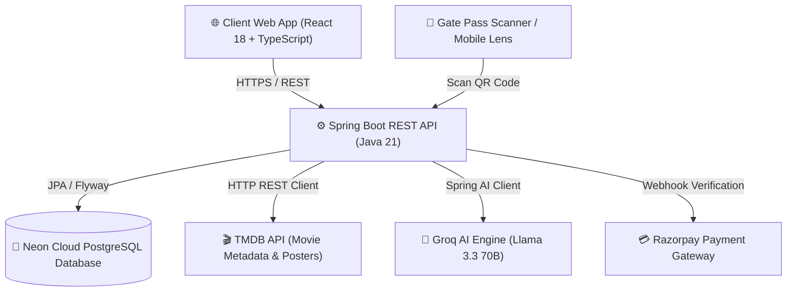
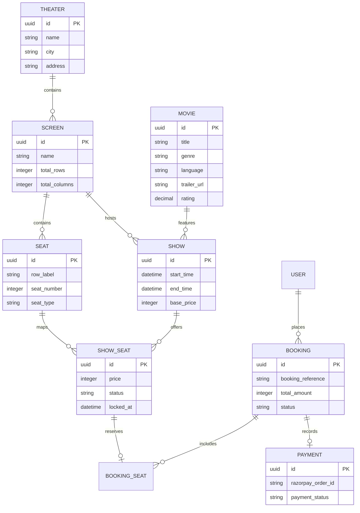
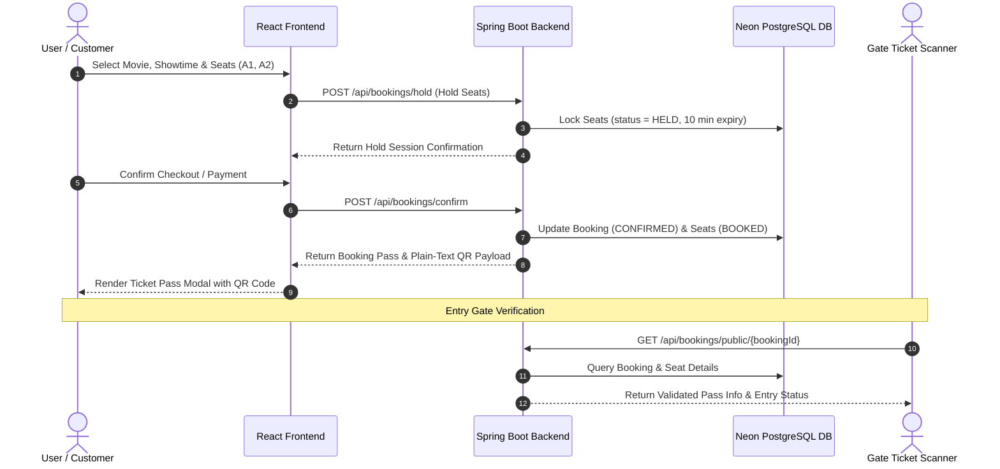
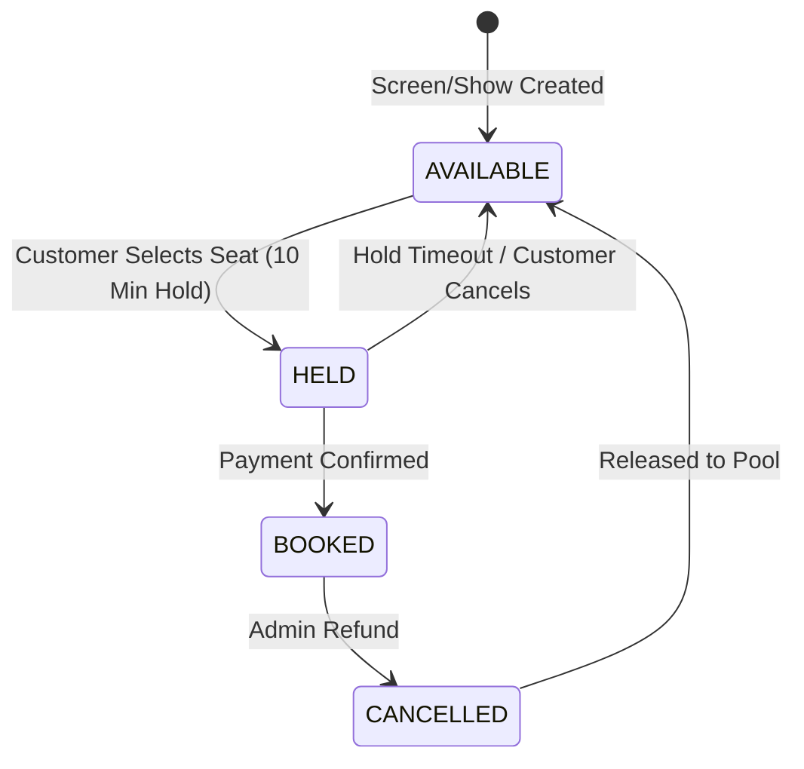

# 🎬 CineBook — Enterprise Movie Ticket Booking & Theater Management Platform

[](https://coruscating-eclair-2724dd.netlify.app/)
[](https://cinebook-api-6cw7.onrender.com)
[](https://www.oracle.com/java/)
[](https://spring.io/projects/spring-boot)
[](https://react.dev/)
[](LICENSE)
[](https://github.com/RishiRaj0128/Cinebook-Movie-Booking-Platform_Rishi_Raj/actions)

> 🌐 **Live Web Application (Netlify):** [https://coruscating-eclair-2724dd.netlify.app/](https://coruscating-eclair-2724dd.netlify.app/)  
> ⚙️ **Production REST API (Render):** [https://cinebook-api-6cw7.onrender.com](https://cinebook-api-6cw7.onrender.com)  
> 📚 **Swagger / OpenAPI Docs:** [https://cinebook-api-6cw7.onrender.com/swagger-ui.html](https://cinebook-api-6cw7.onrender.com/swagger-ui.html)

**CineBook** is a production-ready, full-stack movie ticket reservation and cinema management system engineered for high-concurrency ticket bookings, real-time seat locks, regional cinema discovery, embedded trailer streaming, and automated gate ticket pass validation.

Built with a **Spring Boot 3 (Java 21)** REST backend, **Neon Cloud PostgreSQL**, a **React 18 (TypeScript)** single-page application, and integrated with **Groq AI (Llama 3.3)** for natural language movie recommendations.

---

## 📋 Table of Contents
1. [Executive Summary](#-executive-summary)
2. [Key Capabilities & Features](#-key-capabilities--features)
3. [System Architecture & Tech Stack](#-system-architecture--tech-stack)
4. [Deep-Dive Design Diagrams (Mermaid.js)](#-deep-dive-design-diagrams-mermaidjs)
   - [4.1 High-Level Architecture](#41-high-level-architecture)
   - [4.2 Entity-Relationship (ER) Schema](#42-entity-relationship-er-schema)
   - [4.3 Booking & Gate Verification Sequence](#43-booking--gate-verification-sequence)
   - [4.4 Seat Lock Lifecycle State Machine](#44-seat-lock-lifecycle-state-machine)
5. [Core Business Logic & Algorithms](#-core-business-logic--algorithms)
   - [5.1 Real-Time Seat Hold & Concurrency Control](#51-real-time-seat-hold--concurrency-control)
   - [5.2 Dynamic Tiered Pricing Model](#52-dynamic-tiered-pricing-model)
   - [5.3 Universal QR Gate Pass Engine](#53-universal-qr-gate-pass-engine)
   - [5.4 TMDB Indian Regional Cinema Sync](#54-tmdb-indian-regional-cinema-sync)
6. [Financial Transaction & Payment Engineering (Enterprise Deep Dive)](#-financial-transaction--payment-engineering-enterprise-deep-dive)
   - [6.1 Functional Domain Modeling & Rule Engine](#61-functional-domain-modeling--rule-engine)
   - [6.2 Cryptographic Idempotency](#62-cryptographic-idempotency)
   - [6.3 Concurrency Control & Deadlock-Free Ordering](#63-concurrency-control--deadlock-free-ordering)
   - [6.4 Double-Entry Append-Only Ledger](#64-double-entry-append-only-ledger)
   - [6.5 Strict Finite State Machine](#65-strict-finite-state-machine)
   - [6.6 Smallest Integer Currency Discipline (Paise)](#66-smallest-integer-currency-discipline-paise)
   - [6.7 Saga Pattern & Distributed Compensation](#67-saga-pattern--distributed-compensation)
   - [6.8 Webhook Ingestion & Replay Deduplication](#68-webhook-ingestion--replay-deduplication)
   - [6.9 Induced Failure Recovery & Post-Mortem Log](#69-induced-failure-recovery--post-mortem-log)
7. [REST API Documentation](#-rest-api-documentation)
8. [Security & Authentication Model](#-security--authentication-model)
9. [Repository Directory Structure](#-repository-directory-structure)
10. [Local Development & Setup Guide](#-local-development--setup-guide)
11. [License & Maintainers](#-license--maintainers)

---

## 💡 Executive Summary

CineBook addresses core operational challenges in modern multiplex movie booking:
- **Preventing Double-Booking:** Implements a 10-minute temporary seat hold engine with scheduled lock expiry sweeps.
- **Universal Ticket Pass Verification:** Provides plain-text QR ticket passes compatible with all third-party lenses (Google Lens, iPhone Camera, physical barcode scanners) paired with an unauthenticated public gate verification API (`/api/bookings/public/{id}`).
- **In-App Video Trailer Experience:** Embeds official YouTube 16:9 HD movie trailers directly inside modal windows, completely removing third-party site redirects.
- **Regional Indian Cinema Support:** Synchronizes blockbusters across **Bollywood (Hindi)**, **Tollywood (Telugu)**, **Kollywood (Tamil)**, and **Hollywood (English)**, pre-seeded across 18 Indian metropolitan hubs.

---

## ✨ Key Capabilities & Features

| Capability | Technical Implementation | Business Benefit |
|---|---|---|
| **Universal QR Gate Pass** | Plain-text JSON payload + public verification REST API | Enables 1-second gate verification across any lens or scanner |
| **In-Site HD Trailer Player** | Embedded `<iframe>` stream with fallback dictionary | Zero external redirects; increases user engagement |
| **Real-Time Seat Locks** | Spring `@Scheduled` thread pool + status state machine | Eliminates race conditions during peak ticket booking |
| **Dynamic Tiered Pricing** | Regular, Premium & Recliner multipliers | Maximizes ticket revenue per screening |
| **Groq AI Movie Assistant** | Spring AI + Llama 3.3 70B Engine | Delivers natural language movie recommendations |
| **Regional Cinema Filters** | Dynamic TMDB API sync with regional language mappers | Curates relevant regional cinema for diverse audiences |

---

## 🛠️ System Architecture & Tech Stack

```
 CineBook Full-Stack Platform
 ├── Frontend (React 18 + Vite + TypeScript + Lucide Icons)
 ├── Backend REST API (Java 21 + Spring Boot 3.3.5 + Spring Security JWT)
 └── Database & AI Cloud (Neon PostgreSQL 18 + Groq Llama 3.3 70B)
```

### Backend Micro-Architecture
- **Java 21 LTS** with modern records, pattern matching, and virtual thread execution.
- **Spring Boot 3.3.5** with Spring Security, Spring Data JPA, and Spring AI.
- **Flyway Database Migrations** for automated schema evolution.

### Frontend Architecture
- **React 18** single page application built with **Vite** & **TypeScript**.
- **Lucide React** icons and **HTML5 Canvas QR** renderer.

---

## 🏛️ Deep-Dive Design Diagrams (Mermaid.js)

### 4.1 High-Level Architecture


---

### 4.2 Entity-Relationship (ER) Schema


---

### 4.3 Booking & Gate Verification Sequence


---

### 4.4 Seat Lock Lifecycle State Machine


---

## 🧠 Core Business Logic & Algorithms

### 5.1 Real-Time Seat Hold & Concurrency Control
When a customer selects seats, the backend executes `SeatLockService.holdSeats()` inside a transactional lock.
- Sets `ShowSeat.status = HELD` and `ShowSeat.lockedAt = LocalDateTime.now()`.
- A background scheduler (`LockExpiryScheduler`) runs every 60 seconds to release seats where `lockedAt` exceeds 10 minutes.

### 5.2 Dynamic Tiered Pricing Model
Seat prices are calculated via `PricingUtil.calculateSeatPrice()`:
$$\text{Final Price} = \text{Base Price} \times \text{Seat Type Multiplier}$$
- **Regular Seat:** $1.0\times$ Base Price
- **Premium Seat:** $1.3\times$ Base Price
- **Recliner Seat:** $1.8\times$ Base Price

### 5.3 Universal QR Gate Pass Engine
Generates a structured plain-text string encoded into a QR image:
```text
CINEBOOK PASS #CB-982134
Movie: RRR (Telugu)
Theater: PVR IMAX Director's Cut, Mumbai
Screen: IMAX Screen 1 | Showtime: 06:00 PM
Seats: A1, A2
Customer: Alex Smith (alex@example.com)
Status: CONFIRMED
Pass Verification URL: http://localhost:3000/?ticketId=UUID
```
Because the QR payload contains raw text, any phone lens or gate scanner reads the pass details instantly.

---

## 💳 Financial Transaction & Payment Engineering (Enterprise Deep Dive)

CineBook's payment and transaction core is designed from the ground up to behave like a real financial transaction engine (reflecting the functional-programming rigor and distributed systems discipline practiced at companies like **Juspay**).

### 6.1 Functional Domain Modeling & Rule Engine
- **Immutable Domain Records**: All models (`PaymentRequestRecord`, `TransactionResultRecord`, `LedgerEntryRecord`, `Money`) are defined as Java 21 records or final value objects with zero setters and complete immutability.
- **Pure Rule Predicates**: Fraud, balance, velocity, and transaction limit checks are modeled as pure functions (`Predicate<PaymentRequestRecord>` and `PaymentRule`).
- **Comprehensive Failure Accumulation**: Unlike a standard `.and()` predicate chain that short-circuits on the first error, CineBook's `RuleEvaluationPipeline` evaluates all rules in one pass, returning a full `List<String>` of failed rule reasons for auditing and telemetry.
- **Railway-Oriented Monadic Flow**: Eliminates `null` checks and try/catch sprawl using `Optional` and higher-order functions:
  $$\text{validateRequest}(req) \xrightarrow{\text{flatMap}} \text{checkSeatHold}(req) \xrightarrow{\text{flatMap}} \text{authorizePayment}(req) \xrightarrow{\text{flatMap}} \text{postLedger}(req)$$
- 📖 *For a deep dive on applied FP principles and honest Java limitations (no ADTs, no monadic error accumulation like Haskell's Validation), read [PAYMENT_FP_NOTES.md](file:///d:/Movie%20Booking%20System-II/PAYMENT_FP_NOTES.md).*

### 6.2 Cryptographic Idempotency
- **Client-Generated Keys**: Every payment-initiating request supports an `Idempotency-Key` header.
- **Payload Hash Matching**: The engine calculates a SHA-256 hash of the request payload.
- **Verbatim Cached Replay**: Identical requests return the stored response verbatim with zero redundant charges or database mutations.
- **Conflict Detection (HTTP 409)**: If an existing key arrives with a different request payload, the request is rejected with `IdempotencyConflictException` to catch client bugs.
- **Atomic Persistence**: Handled atomically with database transactions.

### 6.3 Concurrency Control & Deadlock-Free Ordering
- **Pessimistic Row Locking**: Both seat holds and user wallet debits use explicit PostgreSQL row-level locks (`SELECT ... FOR UPDATE` via `LockModeType.PESSIMISTIC_WRITE`).
- **Pessimistic vs Optimistic Rationale**: In high-demand ticketing ("blockbuster drop" scenarios), optimistic locking (`@Version`) causes massive transaction rollbacks and CPU-wasting retry storms. Pessimistic locking immediately serializes contenders at the database row level.
- **Lock Timeout Guardrail**: Enforces `jakarta.persistence.lock.timeout = 3000ms`. If a transaction stalls, contenders fail fast rather than hanging worker threads indefinitely.
- **Deterministic Lock Ordering (Seat $\rightarrow$ Wallet)**: All transactions touching multiple locked resources strictly acquire locks in canonical order: **Seat row lock FIRST, then Wallet row lock SECOND**. This mathematically eliminates cyclic wait-for graphs and prevents database deadlocks.
- **Clean Contention Rejection**: Contenders queue sequentially; the 1st thread acquires the lock and debits the balance to 0. Subsequent threads acquire the lock in turn and are rejected with clean **business rule exceptions** (`InsufficientBalanceException` / `SeatsUnavailableException`), not low-level lock crashes.

### 6.4 Double-Entry Append-Only Ledger
- **No In-Place Balance Drift**: Replaces procedural balance mutations (`UPDATE accounts SET balance = balance - 100`) with an append-only `ledger_entries` table. Rows are **NEVER updated or deleted**.
- **Balanced Transfers**: Every transaction writes exactly two entries (one `DEBIT` and one `CREDIT`) in the same DB transaction:
  $$\sum \text{CREDIT} = \sum \text{DEBIT}$$
- **Zero-Sum Reconciliation Audit**: Automated reconciliation endpoint (`/api/payments/reconciliation/ledger`) executes:
  $$\sum (\text{CASE WHEN direction = 'CREDIT' THEN amount ELSE -amount END}) = 0$$

### 6.5 Strict Finite State Machine
- **Explicit Lifecycle**: Transactions progress through a formal state machine:
  $$\text{CREATED} \rightarrow \text{PROCESSING} \rightarrow \text{AUTHORIZED} \rightarrow \text{CAPTURED} \rightarrow \text{SETTLED}$$
  $$\text{Side branches: } \text{FAILED}, \text{REFUNDED}, \text{PARTIALLY\_REFUNDED}$$
- **Centralized Enforcement**: `TransactionStateMachine` rejects any illegal transition (e.g. `SETTLED` $\rightarrow$ `PROCESSING`) with `InvalidStateTransitionException`.
- **Immutable Audit Trail**: Every state transition is written to `transaction_state_transitions` with timestamp, trigger event, and metadata.

### 6.6 Smallest Integer Currency Discipline (Paise)
- All monetary math is strictly stored and calculated as integers in the smallest currency unit (**paise**), eliminating IEEE 754 floating-point rounding errors ($0.1 + 0.2 \neq 0.3$).
- Decimal rupees are converted strictly at API boundaries using the `Money` value object.

### 6.7 Saga Pattern & Distributed Compensation
- Multi-step booking flows are modeled as an ordered pipeline of `(action, compensation)` pairs:
  1. `ReserveSeatStep` $\leftrightarrow$ `ReleaseSeatCompensation`
  2. `DebitWalletStep` $\leftrightarrow$ `RefundWalletCompensation`
  3. `PostLedgerStep` $\leftrightarrow$ `ReverseLedgerCompensation`
- If any downstream step fails, completed steps are rolled back in reverse order.
- *Compensation Failures*: Any failure during compensation itself is marked as `COMPENSATION_FAILED`, logged with CRITICAL severity, and queued for the background reconciliation sweep.

### 6.8 Webhook Ingestion & Replay Deduplication
- **Mock Payment Gateway**: Simulates realistic asynchronous webhook delivery with induced network timeouts and deliberate duplicate delivery (at-least-once delivery).
- **HMAC-SHA256 Verification**: Constant-time signature verification prevents tampering and unauthorized requests.
- **Event Deduplication**: Webhooks are deduped by event ID through the idempotency engine, preventing double-credits.

### 6.9 Induced Failure Recovery & Post-Mortem Log
- 📖 *For complete technical details on induced network timeouts, webhook replays, and concurrency races, see [INCIDENTS.md](file:///d:/Movie%20Booking%20System-II/INCIDENTS.md).*

---

## 📡 REST API Documentation

### Public Endpoints (No Authentication Required)
| Method | Endpoint | Description |
|---|---|---|
| `GET` | `/api/movies` | List all active movies with optional genre filter |
| `GET` | `/api/movies/{id}` | Get detailed movie metadata & trailer URL |
| `GET` | `/api/theaters/cities` | List all available Indian cities |
| `GET` | `/api/shows/movie/{movieId}` | Get showtimes grouped by theater for a movie |
| `GET` | `/api/shows/{showId}/seats` | Fetch interactive seat layout & hold statuses |
| `GET` | `/api/bookings/public/{id}` | **Public Gate Scanner Verification Endpoint** |

### Authenticated Endpoints (JWT Required)
| Method | Endpoint | Description |
|---|---|---|
| `POST` | `/api/auth/register` | Create a new user account |
| `POST` | `/api/auth/login` | Authenticate user & return JWT tokens |
| `POST` | `/api/bookings/hold` | Temporarily hold selected seats for 10 minutes |
| `POST` | `/api/bookings/confirm` | Confirm booking & complete ticket reservation |
| `GET` | `/api/bookings/my` | View user's ticket booking history |
| `POST` | `/api/ai/recommend` | Natural language AI movie recommendations |

---

## 🔒 Security & Authentication Model

- **Stateless JWT Authentication:** Short-lived access tokens (24 hours) with refresh token rotation.
- **Role-Based Access Control (RBAC):** `ROLE_USER` for customer reservations and `ROLE_ADMIN` for theater/movie management.
- **CORS & CSRF Protection:** Strict origin controls configured in `SecurityConfig.java`.
- **Credential Protection:** Externalized configuration properties with zero plain-text secrets in tracked code.

---

## 📂 Repository Directory Structure

```
Cinebook-Movie-Booking-Platform/
├── cinebook-backend/                  # Spring Boot REST API
│   ├── Dockerfile                     # Multi-stage production build container
│   ├── pom.xml                        # Maven dependencies & Java 21 build specs
│   ├── .env.example                   # Environment configuration template
│   └── src/main/java/com/cinebook/
│       ├── config/                    # Security, CORS & DataInitializer seeds
│       ├── controller/                # REST Controllers (Booking, Movie, Show)
│       ├── domain/                    # JPA Entities, Enums & Repositories
│       ├── dto/                       # Request & Response Data Transfer Objects
│       ├── security/                  # JWT Token Provider & Filter
│       ├── service/                   # Core Business Logic Services
│       └── util/                      # Pricing, QR Generator & Signature Verifier
├── cinebook-frontend/                 # React Single Page Application
│   ├── package.json                   # Dependencies (React, Lucide, Vite)
│   ├── vercel.json                    # Single Page Application routing config
│   └── src/
│       ├── components/                # UI Modals (TicketModal, TrailerModal, SeatMap)
│       ├── context/                   # AuthContext & State Management
│       ├── services/                  # Axios REST API Client
│       └── App.tsx                    # Main Web Application & Layout
├── README.md                          # Platform Technical Specification
└── LICENSE                            # MIT License
```

---

## 🚀 Local Development & Setup Guide

### Prerequisites
- **Java 21 JDK**
- **Node.js 18+** & **npm**
- **Maven 3.9+**

### 1. Clone & Configure Project
```bash
git clone https://github.com/RishiRaj1100/Cinebook-Movie-Booking-Platform.git
cd Cinebook-Movie-Booking-Platform
```

### 2. Launch Backend REST API
```bash
cd cinebook-backend
cp .env.example .env
mvn spring-boot:run "-Dspring-boot.run.jvmArguments=-Dspring.profiles.active=postgres"
```
The REST API initializes PostgreSQL and starts on `http://localhost:8080`.

### 3. Launch Frontend Application
```bash
cd cinebook-frontend
npm install
npm run dev
```
Open `http://localhost:3000` to access the application.

---

## 📄 License & Maintainers

This project is licensed under the **MIT License** — see the [LICENSE](LICENSE) file for details.

Developed & Maintained by **[Rishi Raj](https://github.com/RishiRaj1100)**.
